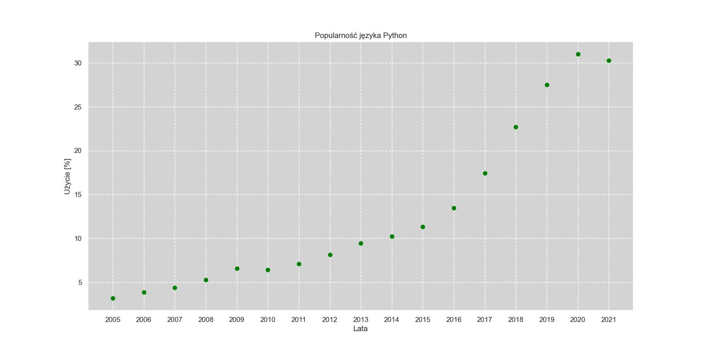
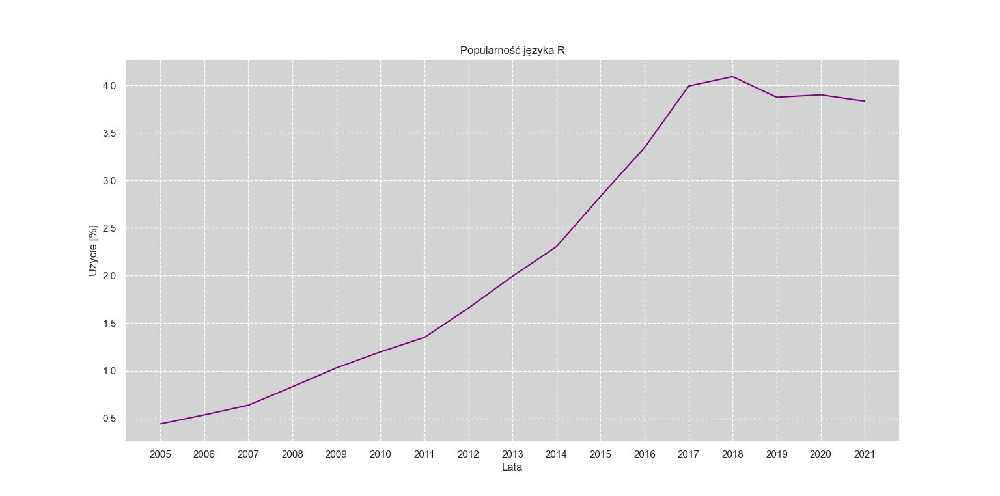
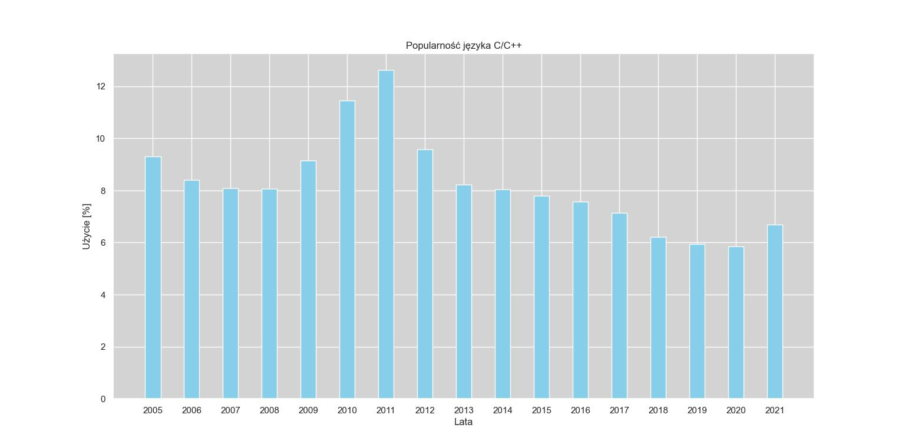
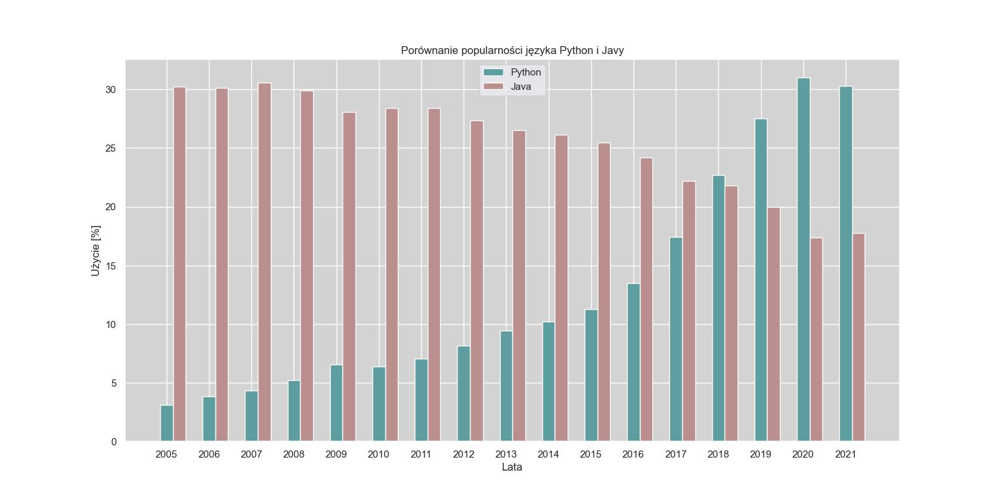
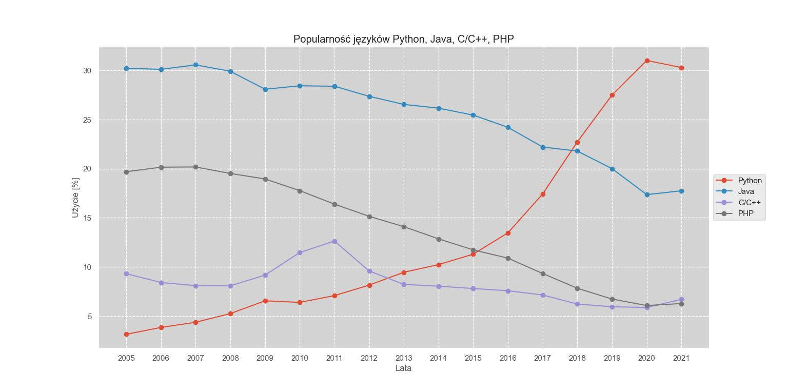
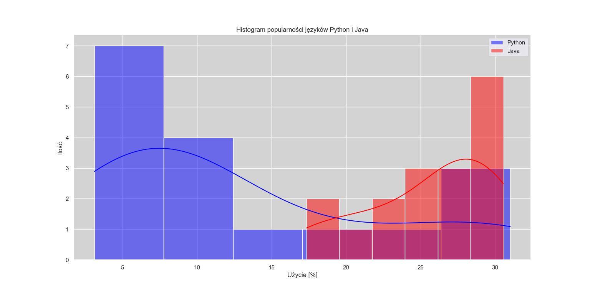
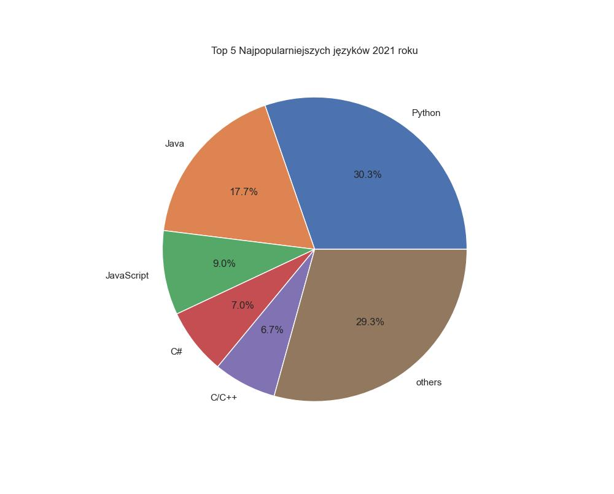

# Najpopularniejsze języki programowania

## Wizualizacja danych

### Spis treści

1. [Wprowadzenie](#1-wprowadzenie)
2. [Cel projektu](#2-cel-projektu)
3. [Opis użytych danych](#3-opis-użytych-danych)
4. [Wczytywanie i przetwarzanie danych](#4-wczytywanie-i-przetwarzanie-danych)
5. [Wizualizacja danych](#5-wizualizacja-danych)
   - [Wykorzystane biblioteki](#51-wykorzystane-biblioteki)
   - [Wykresy](#52-wykresy)
6. [Podsumowanie](#6-podsumowanie)

---

## 1. Wprowadzenie

W dzisiejszym świecie programowania, zrozumienie trendów i zmian w popularności języków programowania ma kluczowe znaczenie dla programistów, firm technologicznych i osób zainteresowanych technologią. Ten projekt ma na celu szczegółową analizę i wizualizację danych dotyczących popularności wybranych języków programowania na przestrzeni lat. Skupimy się głównie na języku Python, ale również porównamy go z innymi popularnymi językami takimi jak Java, C/C++, PHP.

*Pełniejsza analizę oraz sprawozdanie znajduje się w pliku PDF dołączonym do tego repozytorium.*

## 2. Cel projektu

Celem projektu jest:

1. **Analiza trendów**: Analiza zmian popularności poszczególnych języków programowania na przestrzeni lat pozwoli zidentyfikować rozwijające się trendy w świecie programowania. Pozwoli to lepiej zrozumieć, które języki zyskują na popularności, a które tracą.

2. **Porównanie popularności**: Porównanie popularności języka Python z innymi językami programowania pomoże zrozumieć jego pozycję w stosunku do konkurencji. W szczególności zbadamy, czy Python rzeczywiście rośnie w popularności w porównaniu z innymi językami, takimi jak Java czy C/C++.

3. **Wizualizacja danych**: Przedstawienie danych w formie czytelnych i atrakcyjnych wizualizacji ułatwi zrozumienie analizy i pozwoli na szybkie wnioskowanie na temat trendów w popularności języków programowania.

## 3. Opis użytych danych

Dane wykorzystane w tym projekcie pochodzą ze zbioru udostępnionego na platformie [Kaggle](https://www.kaggle.com/). Zbiór ten zawiera informacje na temat popularności różnych języków programowania na przestrzeni lat, przy czym dane są agregowane miesięcznie.

- Plik ten zawiera 29 kolumn.
- Kolumna 1 zawiera daty.
- Kolumny 2-29 zawierają procentowy udział popularności języka w danym miesiącu.

## 4. Wczytywanie i przetwarzanie danych

Na początku wczytujemy dane z pliku CSV, konwertujemy kolumnę "Date" na format rok oraz grupujemy dane po latach, obliczając średnią.

```python
# Importowanie bibliotek
import pandas as pd
import matplotlib.pyplot as plt
import seaborn as sns
import plotly.graph_objects as go
from IPython.display import display

# Wczytywanie danych z pliku CSV
def load_data(file_name):
    data = pd.read_csv(file_name, skiprows=[1, 2, 3, 4, 5, 6, 211])
    data["Date"] = pd.to_datetime(data["Date"]).dt.year
    data = data.groupby("Date").mean().reset_index()
    return data

# Użycie funkcji load_data
data = load_data("Most_Popular_Programming_Languages_from_2004_to_2022.csv")

# Wyświetlenie pierwszych kilku wierszy danych
print(data.head())

# Wyświetlenie całego zestawu danych w postaci tabeli
display(data)

# Eksport danych do pliku Excel
data.to_excel("dane.xlsx", index=False)

display(data1)
```

## 5. Wizualizacja danych

### 5.1 Wykorzystane biblioteki

- **Matplotlib**: Jest to jedna z najpopularniejszych bibliotek do wizualizacji danych w języku Python. Oferuje szeroki zakres funkcji do tworzenia różnorodnych wykresów, takich jak wykresy liniowe, słupkowe, punktowe, histogramy itp. Matplotlib daje użytkownikowi pełną kontrolę nad wyglądem i stylem wykresów.
- **Seaborn**: Seaborn to biblioteka oparta na Matplotlib, która zapewnia interfejs wysokiego poziomu do tworzenia atrakcyjnych i informatywnych wykresów statystycznych. Jest szczególnie przydatna do eksploracyjnej analizy danych oraz prezentacji rozkładów i relacji między zmiennymi.
- **Plotly**: Plotly to narzędzie do tworzenia interaktywnych i dynamicznych wykresów. Umożliwia tworzenie interaktywnych wizualizacji danych, które można łatwo dostosowywać i eksplorować. Jest często wykorzystywane do prezentacji danych na stronach internetowych i w aplikacjach.

W sprawozdaniu wykorzystane są te biblioteki do generowania różnych rodzajów wykresów, takich jak wykresy punktowe, liniowe, słupkowe, histogramy i wykresy kołowe. Dzięki nim możemy lepiej zrozumieć dynamikę zmian w popularności języków programowania oraz porównać ich udziały w różnych okresach czasu. Dodatkowo, interaktywne wykresy Plotly umożliwiają bardziej zaawansowaną analizę danych poprzez eksplorację danych przy użyciu interakcji z wykresem.

### 5.2 Wykresy

1. **Scatter Plot - Popularność języka Python w kolejnych latach**

Wykres punktowy przedstawiający zmiany popularności języka Python w kolejnych latach.

```python
# Scatter Plot
plt.figure(figsize=(12, 6))
plt.scatter(data['Date'], data['Python'],color='green', marker='o',zorder=2)
plt.title("Popularność języka Python")
plt.xlabel('Lata')
plt.ylabel('Użycie [%]')
plt.grid(True, linestyle='--', color='white')  # Dodanie białych linii siatki
plt.gca().set_facecolor('lightgray')  # Ustawienie szarego tła
plt.xticks(sorted(data['Date'].unique()))  # Unikalne lata na osi x
plt.show()
```



Na wykresie punktowym przedstawiającym popularność języka Python w zależności od lat, możemy zaobserwować wzrost jego używania w miarę upływu czasu. 

2. **Line Chart - Popularność języka R w kolejnych latach**

Wykres liniowy przedstawiający zmiany popularności języka R w kolejnych latach.


```python
# Line Chart
    plt.figure(figsize=(12, 6))
    plt.plot(data['Date'], data['R'], color="purple",zorder=2)
    plt.title("Popularność języka R")
    plt.xlabel('Lata')
    plt.ylabel('Użycie [%]')
    plt.grid(True, linestyle='--', color='white')
    plt.gca().set_facecolor('lightgray')
    plt.xticks(sorted(data['Date'].unique()))
    plt.show()

```



Wykres linowy pokazuje, że popularność języka R oscyluje wokół określonego poziomu w badanym okresie, zauważalny wzrost popularności.

3. **Bar Chart - Popularność języka C/C++ w kolejnych latach**

Wykres słupkowy przedstawiający zmiany popularności języka C/C++ w kolejnych latach.


```python
# Bar Chart
    plt.figure(figsize=(12, 6))
    plt.bar(data['Date'], data['C/C++'], color ='skyblue', width=0.4,zorder=2)
    plt.title("Popularność języka C/C++")
    plt.xlabel('Lata')
    plt.ylabel('Użycie [%]')
    plt.grid(True, linestyle='-', color='white')
    plt.gca().set_facecolor('lightgray')
    plt.xticks(sorted(data['Date'].unique()))
    plt.show()
```



Wykres słupkowy pokazuje stabilność popularności języka C/C++ w badanym okresie.

4. **Bar Chart  - Porównanie Pythona i Javy w kolejnych latach**

Wykres słupkowy porównujący popularność języka Python i Javy w kolejnych latach.

```python
# Porównanie Pythona i Javy
    plt.figure(figsize=(12, 6))
    plt.bar(data['Date'], data['Python'], color ='cadetblue', width=0.3, label="Python",zorder=2)
    plt.bar(data['Date'] + 0.3, data['Java'], color ='rosybrown', width=0.3, label="Java",zorder=2)
    plt.title("Porównanie popularności języka Python i Javy")
    plt.xlabel('Lata')
    plt.ylabel('Użycie [%]')
    plt.legend()
    plt.grid(True, linestyle='-', color='white')
    plt.gca().set_facecolor('lightgray')
    plt.xticks(sorted(data['Date'].unique()))
    plt.show()

```



Wykres porównawczy pokazuje, że Python zyskuje na popularności w stosunku do Javy w badanym okresie.

5. **Bar Chart - Popularność języków w 2021 roku**

Wykres słupkowy przedstawiający udziały poszczególnych języków programowania w 2021 roku.

```python
# Line chart
    # Plotting multiple graphs

def plot_with_matplotlib(data):
    """
    Wyświetla wykres liniowy przedstawiający popularność różnych języków programowania 
    (Python, Java, C/C++, PHP) w kolejnych latach.
    """
    plt.figure(figsize=(12,6))
    plt.style.use('ggplot')

    plt.plot(data['Date'], data['Python'], marker="o", label="Python")
    plt.plot(data['Date'], data['Java'], marker="o", label="Java")
    plt.plot(data['Date'], data['C/C++'], marker="o", label="C/C++")
    plt.plot(data['Date'], data['PHP'], marker="o", label="PHP")
    plt.xticks(data['Date'])

    plt.title("Popularność języków Python, Java, C/C++, PHP")
    plt.xlabel('Lata')
    plt.ylabel('Użycie [%]')

    # Dodanie legendy z boku wykresu
    plt.legend(loc='center left', bbox_to_anchor=(1, 0.5))
    
    # Dodanie szarego tła
    plt.gca().set_facecolor('lightgray')
    
    # Dodanie białych linii siatki
    plt.grid(True, linestyle='--', color='white')
    
    plt.show()

```



Wykres linowy pokazuje, że popularność języka R oscyluje wokół określonego poziomu w badanym okresie, zauważalny wzrost popularności.


6. **Histogram popularności języków Python i Java**

Histogramy porównujące dystrybucję popularności języków Python i Java wśród programistów. Każdy histogram przedstawia procentowy udział użycia danego języka w projektach programistycznych. Linie wygładzone (KDE) pokazują estymowaną gęstość rozkładu, co umożliwia lepsze zrozumienie kształtu rozkładu danych.


```python
plt.figure(figsize=(12, 6))
    sns.histplot(data=data, x="Python", color="blue", label="Python", kde=True)
    sns.histplot(data=data, x="Java", color="red", label="Java", kde=True)
    plt.title("Histogram popularności języków Python i Java")
    plt.xlabel('Użycie [%]')
    plt.ylabel('Ilość')
    plt.legend()
    plt.grid(True, linestyle='-', color='white')
    plt.gca().set_facecolor('lightgray')
    plt.show()
```



Ten wykres porównawczy ułatwia zrozumienie różnic w dystrybucji popularności języków Python i Java. Porównując oba histogramy, można szybko zobaczyć, który język ma większą lub mniejszą koncentrację w określonych zakresach procentowych. Dodatkowo, obecność krzywych KDE pozwala na ocenę kształtu rozkładu danych dla obu języków.

7. **Wykres kołowy top 5 najpopularniejszych języków w 2021 roku**

Ten wykres kołowy prezentuje procentowy udział top 5 najpopularniejszych języków programowania w roku 2021. Dane zostały przetworzone, aby wybrać 5 najpopularniejszych języków oraz zsumować udziały pozostałych języków pod kategorią "others". Wykres kołowy jest czytelny i łatwy do zrozumienia, a wartości procentowe na kawałkach koła pozwalają szybko ocenić proporcje między poszczególnymi językami.


```python
# Przetwarzanie danych dla roku 2021
data2 = data.set_index("Date")
data3 = data2.T
data4 = data3[2021]
data5 = data4.sort_values(ascending=False)

# Top 5 najpopularniejszych języków
data6 = data5[:5].copy()

# Tworzenie DataFrame z wszystkimi językami
data7 = pd.DataFrame({'language': data5.index, 'percentage': data5.values})

# Tworzenie DataFrame z top 5 językami
data6 = pd.DataFrame({'language': data6.index, 'percentage': data6.values})

# Dodanie kategorii 'others'
new_row = pd.DataFrame(data={
    'language': ['others'],
    'percentage': [data7['percentage'][5:].sum()]})

```



Ten wykres kołowy pozwala na szybkie zrozumienie, które języki programowania były najpopularniejsze w roku 2021. Dzięki wykorzystaniu kategorii "others", można również zobaczyć, jaki procent popularności zajmują inne języki programowania spoza top 5.

## 6. Podsumowanie

Podsumowując, wizualizacja danych w Pythonie jest niezwykle istotnym narzędziem w analizie danych i komunikacji wyników. Dzięki bogactwu bibliotek i narzędzi, jakie oferuje Python, można tworzyć wizualizacje na różnych poziomach skomplikowania, dopasowane do potrzeb konkretnego projektu. Jest to nie tylko sposób prezentacji wyników, ale także narzędzie do odkrywania wzorców, trendów i zależności w danych.

Jednakże warto pamiętać, że sama wizualizacja to tylko część procesu analizy danych. Ważne jest również odpowiednie zrozumienie danych, umiejętność interpretacji wykresów i wyciąganie wniosków na ich podstawie. Dlatego też wizualizacja danych powinna być traktowana jako środek do celu - ułatwienia zrozumienia danych i wspierania podejmowania decyzji opartych na faktach.
